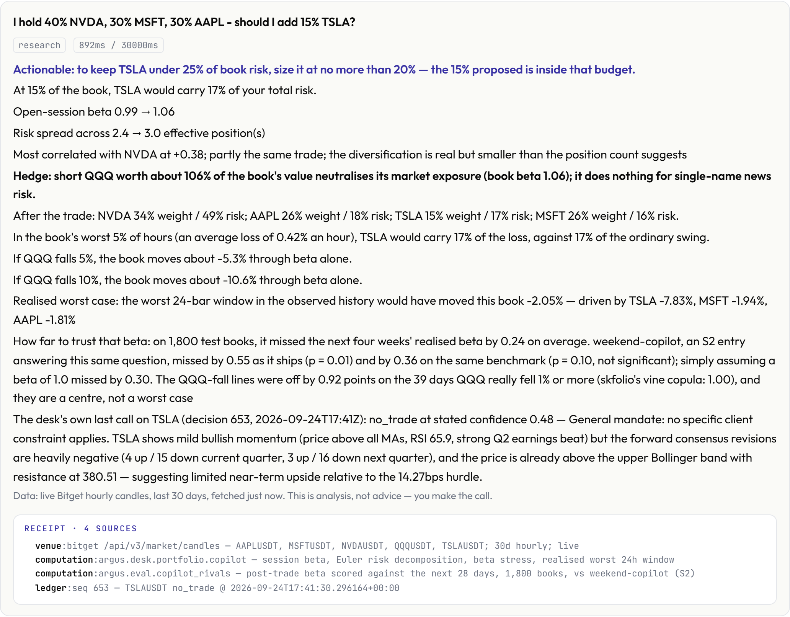

# ARGUS

**A research desk for Bitget's tokenized US stocks. Ask in plain language; every number is
computed from live data and names its source.**

**Live console: https://deploy-topaz-seven-64.vercel.app** · [one research task, run
live](https://deploy-topaz-seven-64.vercel.app/research) · [what we beat](https://deploy-topaz-seven-64.vercel.app/proof)
· [what we got wrong](https://deploy-topaz-seven-64.vercel.app/wrong)
· [status](https://deploy-topaz-seven-64.vercel.app/status)

<picture>
  <source media="(prefers-color-scheme: dark)" srcset="docs/img/console-answer-dark.png">
  
</picture>

Built for Bitget AI Base Camp / Genesis Hackathon Season 2. Nothing on this page needs an account
or a key to try.

---

## What this entry is

ARGUS is this team's **Track 3 — AI Trading Desk** entry: a natural-language research workbench.
A trader asks; the engines answer from Bitget's market data, SEC filings, FRED and the news; every
answer ends in a receipt naming its sources, and the trader makes the call.

The same team entered Track 2 with a **separate project**,
[t2-sentiment-agent](https://github.com/Pratiikpy/t2-sentiment-agent): its own repository, code,
paper-trading ledger and demo, submitted through its own form, as the handbook requires of a second
entry (Basic Competition Rules, rule 2). Nothing in this repository is part of that entry.

---

## Try it in a minute

Open the console and ask any of these. Each one exercises something different.

| Ask | What it shows |
|---|---|
| *I hold 40% NVDA, 30% MSFT, 30% AAPL — should I add 15% TSLA?* | Your book's risk before and after, sized to a risk budget, a hedge, stress cases, and how far to trust the beta — scored against weekend-copilot, an S2 rival answering the same question. |
| *How should I split a $50k order in NVDA?* | An execution schedule priced on the live order book, measured against Bitget's own TWAP on a full-depth replay. |
| *How does NVDA react to CPI?* | An event study over past releases, with the tests that say whether the reaction is real. |
| *Is the hype on NVDA real?* | Headlines grouped into stories, so five outlets repeating one article count once. |
| *I hold NVDA r-token overnight — how do I hedge it?* | The spot rToken hedged with the same company's perpetual, tested on held-out nights. |
| *Long MSTR perp into earnings — funding looks cheap* | Your own premise tested first — funding against the contract's last 100 settlements — then the earnings half: report date, analyst targets, the last surprise, holders, filings. |
| *Will MSTR be higher in 48 hours?* | Not a forecast: how often it finished higher over every past 48-hour window, with an interval that counts overlapping windows honestly, the cost of holding, and what Polymarket prices. |
| *What if I trim TSLA to 10% of my book?* | A resize, not an add: every other holding rescaled, risk share before and after, and the weight that fits your budget. |
| *Where will NVDA open?* | While the US market is shut: the price the stock's own perpetual implies for the next open, with that reading's measured miss beside two S2 rivals'. |
| *ETH open interest* | How much is held open, how many days of today's volume that is, and where it ranks among every liquid Bitget perpetual. |
| *What is the long/short ratio on SOL?* | Bitget's own split for any perpetual: the share of accounts long, its change on the day, and the share of position size — the crowd against the larger money. |
| *How much does TQQQ decay if QQQ goes sideways for a month?* | What the fund actually lost against 3× its index in every sideways month of its history, beside the compounding formula at today's volatility. |
| *Should I hedge with gold or with TLT?* | The hedges you named measured against your book first, then the listed leg that does the job better, sized and costed. |

Every line of an answer is tagged with where it comes from: **live** (read just now),
**computed** (worked out for this answer), **record** (a measured past result, its sample
named), **desk** (quoted from the agent's logged decision), **assumed** (a default the question
left open) or **missing** (could not be read). On 18 questions never seen while the tags were
written, 94% of content lines carried one; a line no rule recognises carries none rather than a
guess (`python -m argus.eval.provenance_audit`).

Put your holdings in **My book** once and every answer uses them. Tell it about yourself — *I
can't lose more than 10%*, *I'm a swing trader*, *I think NVDA runs on AI capex* — and it remembers,
in your browser only: later answers apply your loss limit, holding period and risk budget, and show
your thesis beside every answer about that name with the move since you stated it, each time on a
**memory** line saying so. Measured on 20 two-session tasks: 20 answers changed by memory, none
with memory off, none reaching another trader (`python -m argus.eval.memory_eval`). Every answer ends by naming the
sources it reached and any that did not answer. If the desk cannot source a figure, it refuses and
says why. Ask in Chinese, Japanese, Korean, Spanish, Portuguese, French or German and the answer
comes back in that language: the engines write English, Qwen translates, and every number in each
translated line is checked against the English — a line whose figures do not match stays English.

The same desk answers in Telegram at [@argusbitgetbot](https://t.me/argusbitgetbot): `/book` saves
your holdings for the chat, and orders are refused there as everywhere.

**Who it is for:** a trader holding Bitget's tokenized US equities who wants a second desk that
shows its work. **What it is not:** a signal service. No strategy here has cleared its own
deflation gate, and the console says so.

---

## What we beat, and what beat us

Every capability is held against the specialist that leads its sub-theme, run on the same input,
and graded by a register that opens the evidence rather than trusting a filename
(`python -m argus.eval.standing`). **7 of 43 capabilities are OWNED, 12 are TIED, 24 are
IMPLEMENTED, and 0 are LOST.** OWNED needs all thirteen conditions: the rival's best
implementation read and reproduced, a same-input comparison with costs, out-of-sample, ablation,
an adversarial test, documented failure cases and reproducibility.

The register got stricter on 2026-09-26 and the count fell from 20 to 8. A proof that rests on a
population figure must now survive a per-group check — by symbol and by half of the sample — and 12
capabilities went back to IMPLEMENTED: five because their headline was carried by one symbol or
flipped between halves, seven because their proof is a designed case set the new check cannot
grade, which needs its own construction test before it can count again. Each row names its route
back (`data/standing.json`). One more went to TIED the same day: breadth rotation had beaten
pytaa, which silently drops weight, but a general-purpose validator (pandera with pydantic)
configured to the same contract handles the same 36 cases, so a margin over the specialist was
not a margin over the best tool for the job.

Losses are published the moment they are found. Two were found and closed on 2026-09-24: Bitget's
own 60-second TWAP beat the schedule the console printed (6.9 against 12.2bps on a $100k order),
and the S2 entry Ballast hedged an rToken holder's nights far better than ARGUS's index hedge.
Both now tie, and both losses stay on [`/wrong`](https://deploy-topaz-seven-64.vercel.app/wrong).
Two more S2 desks were run on the same input on 2026-09-25. MirrorLine checks a trader's claims
about the tape: on the first run ARGUS gave a verdict on 18 of 38 claims to MirrorLine's 38, the
fix went in the same morning, and the re-run tied at 30 of 30 gradable claims. optic-bitget debates
a thesis with a model judge: it abstained on two of three theses for want of earnings and
positioning data that ARGUS answered, while it still gives one synthesised call ARGUS does not — a
tie, with the losing half named. baserate prices a leveraged weekend hold: ARGUS first answered a
different question, then was rebuilt to read 1,443 NVDA weekends since 1999, the perpetual's own
path through each weekend and Bitget's live margin tier — a tie, since baserate still matches the
current regime to past weekends. Rook ends each thesis with an invalidation price: on six names its
stops sat 0.1-1.7% away and ordinary movement reached them on 62% of held-out days, against 11%
for ARGUS's measured stop, fitted out of sample — ahead on that one measure, six names, one run.
Two desks estimate where a stock should open while the US market is shut. gloaming blends index
futures, crypto and the dollar; over 113 nights and 8 stocks its best variant missed the next
open by 81bps on average, against 30bps for ARGUS's reading of the stock's own perpetual (93% of
directions right) and 90bps for assuming no gap — level only on QQQ. nocturne fades the rToken's
weekend move back to Friday's price; on its own question (the rToken's Monday 10:00 price) its
reproduced walk-forward and ARGUS came out level, 1.92% against 2.07%. But on the stock's real
Monday open, read at nocturne's Sunday-evening moment, the perpetual's weekend move carried
through (slope +0.83, 160 stock-weekends) rather than reversing, and beat Friday's close.
The full table, rival by rival, is on [`/proof`](https://deploy-topaz-seven-64.vercel.app/proof).

---

## Bitget's toolkit, used and measured

| Surface | Where ARGUS uses it | Measured |
|---|---|---|
| Public market API (v3) | Candles, tickers, 50-level books, funding — every price and cost in the console | Answering, checked live on `/status` |
| Order-book websocket (`books5`, trades) | Execution replay and the order-splitting comparison | Recorded locally, RFC 6455 client |
| `bitget-mcp-server` | US fundamentals, 13F holders, analyst estimates, earnings calendar, the stock behind each rToken | 37 of 67 catalog entries answered |
| `bitget-signal` Skills | Technicals (MACD corrected against Bitget's own candles), sentiment, macro, news, market intel | Bitget's server answered 6 of 19; ARGUS read the other 13 from the sources those Skills name — 19 of 19, all 5 Skills |

When a Skill's hosted server fails, ARGUS reads the source that Skill names (alternative.me,
Binance futures data, FRED, Yahoo, DeFiLlama, CoinGecko, the RSS feeds). Every such answer says
it came from the source, not the Skill, and the two counts are never merged
(`argus/src/argus/market/skill_mirror.py`).

---

## Call it from an agent

ARGUS is also a **Model Context Protocol server**: any MCP client can add
`https://deploy-topaz-seven-64.vercel.app/mcp` (Streamable HTTP) and call six tools — `argus_ask`
(the whole console, any language), `argus_quote`, `argus_portfolio_impact`, `argus_stress` (a shock
on the Nasdaq or on any instrument), `argus_execution_plan` and `argus_scoreboard`. They run the
same engines as the page; none of them writes or trades.

---

## Run it yourself

```bash
cd argus
pip install -e ".[dev]"
python -m argus.status          # module and sub-theme coverage, resolved by import
python -m argus.lui.server      # the console on http://127.0.0.1:8765
pytest -q                       # 6,700 tests collected
```

Nothing above needs a credential. The full run took 1h16m from a fresh GitHub clone on
2026-09-24 — 6,457 passed, 85 skipped, 0 failed; tests that need a rival's source cloned beside
the repository skip and say which. `ARGUS_BLOCK_NETWORK=1` refuses every outbound connection, so
a test that reaches the network shows itself.

| | |
|---|---|
| **The code** | [`argus/`](argus/) — package, tests, runnable studies |
| **How it fits together** | [`ARGUS-ARCHITECTURE.md`](ARGUS-ARCHITECTURE.md) |
| **Every claim, explained** | [`ARGUS-EXPLAINED.md`](ARGUS-EXPLAINED.md) |
| **Reproduce a headline number** | [`argus/VERIFY.md`](argus/VERIFY.md) |
| **What runs and what is blocked** | [`argus/STATUS.md`](argus/STATUS.md) |

---

## What is verified

| | |
|---|---|
| Tests | **6,700 tests collected** — `pytest -q` |
| Types | **`mypy --strict` clean on 456 source files** |
| Lint | `ruff` clean |
| Modules | **152/152 modules importable**, checked by `python -m argus.status` |
| Sub-themes | **18/18 sub-themes**, resolved by import at runtime, not claimed in prose |
| Understanding | 240 questions in 12 languages, written by an agent that never saw this repository, scored without reading its misses: the console, with no language model, read **52.1% → 81.7%** of them correctly after 2026-09-25 (85.0% with a saved book; on the live site Qwen reads first and this is the fallback); the trained question classifier alone reads 91.3%; with Qwen reading first the console reads 85.0% — `data/lui_final_heldout_report.json` |
| Quoted figures | Every figure these documents quote is re-checked against its artefact by `python -m argus.eval.docclaims --tests`, which fails if one has drifted |

## What the code will not let happen

- **A zero-fee backtest cannot be built.** `CostModel` raises rather than defaulting to free.
- **Omitting `as_of` is a `TypeError`.** Point-in-time evidence cannot be queried carelessly.
- **The risk layer may only reduce.** It cannot create, flip or grow a position.
- **A maker fee needs a book.** Passive fills go through a queue model ported from hftbacktest.
- **Search cannot see evaluation.** `ProposerContext` has no field that can hold a score.
- **The ledger is hash-chained**, and a tampered chain is refused rather than scored.

---

## Honest limits

- **ARGUS's own paper desk has no settled trades.** Every decision on its ledger is a refusal, so
  its Sharpe, drawdown and win rate are undefined and printed as such. Each refusal carried a
  direction, hashed before the outcome existed: at about two hours, **206 of 347 directional calls
  were right**, which barely clears a coin flip and does not beat calling "up" every time. The
  median refusal **forgave -4.5bps of net edge** after the 12bps round trip — the trades it passed
  on were mostly unprofitable. This workbench does not trade; trading is the separate Track 2
  project's job.
- **No certified alpha.** 0 of 8 factors and 0 of 12 strategies cleared the deflation gate.
- **Price discovery attenuates about 7x while the anchor market is shut — it does not stop.** The
  weekend effect failed its own out-of-sample split, and the 3–5x off-hours spread widening first
  claimed here was falsified. Both are reported as negatives.

---

## 中文简介

ARGUS 是面向 Bitget 美股代币（rToken）的研究工作台（Track 3 · AI Trading Desk）。用自然语言提问，
七个引擎基于 Bitget 行情、SEC 文件、FRED 与新闻实时计算，每个数字都注明来源；语言模型只理解问题，
从不编写数字。43 项能力逐一与各子赛道领先的专业系统在相同输入上对比：7 项领先（OWNED）、12 项
持平、24 项已实现、0 项落后，所有落败记录公开在 `/wrong`。本团队的 Track 2 参赛作品是另一个独立项目
（t2-sentiment-agent，独立的代码库、交易日志与演示），不属于本仓库。

---

## Licence

MIT. Components ported from other projects cite their source file and line in the docstring;
everything copied is MIT, BSD or Apache licensed, and anything under a restrictive licence was
rebuilt from its described behaviour rather than copied.
