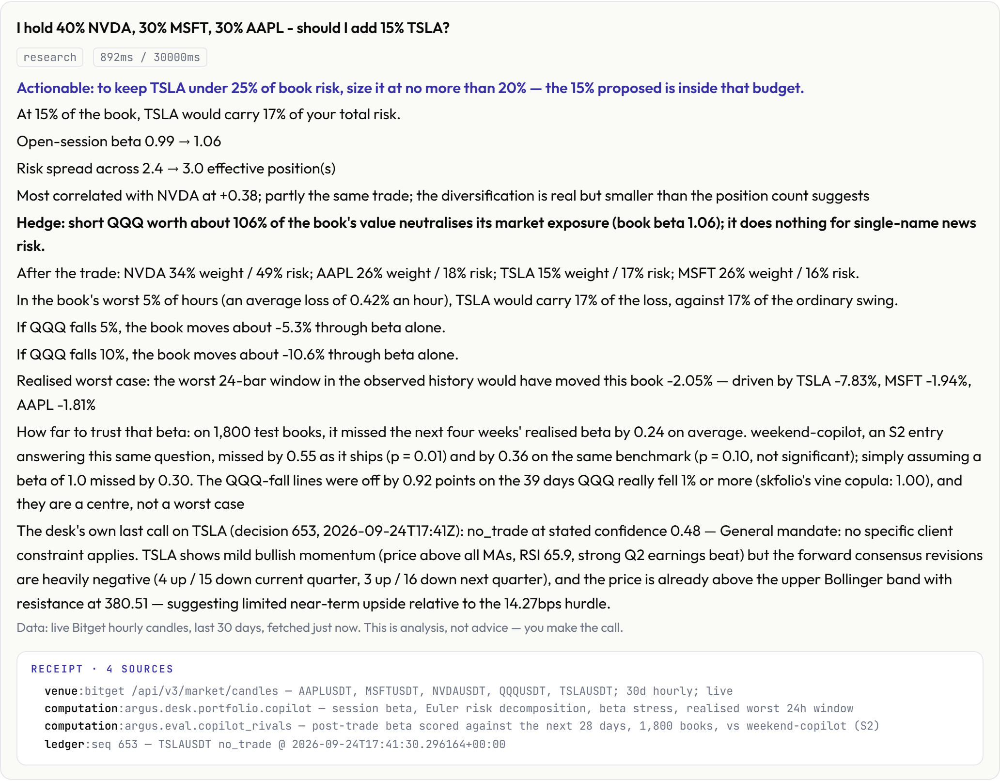

# ARGUS

[](https://github.com/Pratiikpy/argus-bitget/actions/workflows/ci.yml)

**A research desk for Bitget's tokenized US stocks. Ask in plain language; every number is
computed from live data and names its source.**

**Live console: https://deploy-topaz-seven-64.vercel.app** · [one research task, run
live](https://deploy-topaz-seven-64.vercel.app/research) · [what we beat](https://deploy-topaz-seven-64.vercel.app/proof)
· [what we got wrong](https://deploy-topaz-seven-64.vercel.app/wrong)
· [status](https://deploy-topaz-seven-64.vercel.app/status)

<picture>
  <source media="(prefers-color-scheme: dark)" srcset="docs/img/console-answer-dark.png">
  
</picture>

Built for Bitget AI Base Camp / Genesis Hackathon Season 2. Nothing on this page needs an account
or a key to try.

---

## What this entry is

ARGUS is this team's **Track 3 — AI Trading Desk** entry: a natural-language research workbench.
A trader asks; the engines answer from Bitget's market data, SEC filings, FRED and the news; every
answer ends in a receipt naming its sources, and the trader makes the call.

The same team entered Track 2 with a **separate project**,
[t2-sentiment-agent](https://github.com/Pratiikpy/t2-sentiment-agent): its own repository, code,
paper-trading ledger and demo, submitted through its own form, as the handbook requires of a second
entry (Basic Competition Rules, rule 2). Nothing in this repository is part of that entry.

---

## Try it in a minute

Open the console and ask any of these. Each one exercises something different.

| Ask | What it shows |
|---|---|
| *I hold 40% NVDA, 30% MSFT, 30% AAPL — should I add 15% TSLA?* | Your book's risk before and after, sized to a risk budget, a hedge, stress cases, and how far to trust the beta — scored against weekend-copilot, an S2 rival answering the same question. |
| *How should I split a $50k order in NVDA?* | An execution schedule priced on the live order book, measured against Bitget's own TWAP on a full-depth replay, and the first child written as the Agent Hub `bgc --dry-run` command that previews it without sending. |
| *What are my sector and factor exposures if I add 10% XOM?* | Sectors, industries and eight factor betas with their t-statistics — market, size, momentum, value, quality, low volatility, rates and crypto, widened from four after the eight explained 9 of 13 names better out of sample. |
| *Long rNVDA over the weekend at 3x* | The stock's weekends since 1999, a band for Monday's open scaled to its volatility now, which covered 79% of 17,044 weekends out of sample against an 80% target, and the perpetual's own path to the liquidation line. |
| *Review my trades: bought NVDA at 188, sold at 176 …* | Your habits across the trades and a checklist, kept and run again the next time you ask about adding a name. |
| *What's trending right now?* | The coins drawing the crowd, checked against Bitget's board: listed or not, the 24-hour move, the funding rate. Also: *top DeFi protocols by TVL*, *how much is ETH gas*. |
| *How does NVDA react to CPI?* | An event study over past releases, with the tests that say whether the reaction is real. |
| *Is the hype on NVDA real?* | Headlines grouped into stories, so five outlets repeating one article count once. |
| *I hold NVDA r-token overnight — how do I hedge it?* | The spot rToken hedged with the same company's perpetual, tested on held-out nights. |
| *Long MSTR perp into earnings — funding looks cheap* | Your own premise tested first — funding against the contract's last 100 settlements — then the earnings half: report date, analyst targets, the last surprise, holders, filings. |
| *Will MSTR be higher in 48 hours?* | Not a forecast: how often it finished higher over every past 48-hour window, with an interval that counts overlapping windows honestly, the cost of holding, and what Polymarket prices. |
| *What if I trim TSLA to 10% of my book?* | A resize, not an add: every other holding rescaled, risk share before and after, and the weight that fits your budget. |
| *Where will NVDA open?* | While the US market is shut: the price the stock's own perpetual implies for the next open, with that reading's measured miss beside two S2 rivals'. |
| *ETH open interest* | How much is held open, how many days of today's volume that is, and where it ranks among every liquid Bitget perpetual. |
| *What is the long/short ratio on SOL?* | Bitget's own split for any perpetual: the share of accounts long, its change on the day, and the share of position size — the crowd against the larger money. |
| *How much does TQQQ decay if QQQ goes sideways for a month?* | What the fund actually lost against 3× its index in every sideways month of its history, beside the compounding formula at today's volatility. |
| *Should I hedge with gold or with TLT?* | The hedges you named measured against your book first, then the listed leg that does the job better, sized and costed. |

Every line of an answer is tagged with where it comes from: **live** (read just now),
**computed** (worked out for this answer), **record** (a measured past result, its sample
named), **desk** (quoted from the agent's logged decision), **assumed** (a default the question
left open) or **missing** (could not be read). On 18 questions never seen while the tags were
written, 94% of content lines carried one; a line no rule recognises carries none rather than a
guess (`python -m argus.eval.provenance_audit`).

Put your holdings in **My book** once and every answer uses them. Tell it about yourself — *I
can't lose more than 10%*, *I'm a swing trader*, *I think NVDA runs on AI capex* — and it remembers,
in your browser only: later answers apply your loss limit, holding period and risk budget, and show
your thesis beside every answer about that name with the move since you stated it, each time on a
**memory** line saying so. Measured on 20 two-session tasks: 20 answers changed by memory, none
with memory off, none reaching another trader (`python -m argus.eval.memory_eval`). Every answer ends by naming the
sources it reached and any that did not answer. If the desk cannot source a figure, it refuses and
says why. Ask in Chinese, Japanese, Korean, Spanish, Portuguese, French or German and the answer
comes back in that language: the engines write English, Qwen translates, and every number in each
translated line is checked against the English — a line whose figures do not match stays English.

The same desk answers in Telegram at [@argusbitgetbot](https://t.me/argusbitgetbot): `/book` saves
your holdings for the chat, and orders are refused there as everywhere.

**Run your own.** Like OpenClaw or Hermes Agent, the desk also runs as your own Telegram bot, on
your machine, with your token — nothing of yours passes through our servers:

```bash
pip install -e argus                                  # or: uv sync --frozen, in argus/
argus-bot setup --token <token from @BotFather>       # checks it, keeps it in ~/.argus
argus-bot run                                         # long polling: no server, no public URL
```

Message your bot once and approve the code it gives you (`argus-bot pairing approve <CODE>`): you
become its owner, and a stranger gets a code and nothing else until you approve them too
(`--policy allowlist --allow <id>` locks it to named user ids instead). Your book, what you told
the desk and your alerts stay in `~/.argus` across restarts, and alerts fire while it runs:
`/watch NVDA below 170`, `/watch MSTR funding 0.05%`. No model key is needed; the desk reads
questions with its own classifier.

**Who it is for:** a trader holding Bitget's tokenized US equities who wants a second desk that
shows its work. **What it is not:** a signal service. No strategy here has cleared its own
deflation gate, and the console says so.

---

## What we beat, and what beat us

Every capability is graded against the specialist that leads its sub-theme, by a register that
opens the evidence rather than trusting a filename (`python -m argus.eval.standing`), and may claim
OWNED only after that rival has been run on the same input and beaten.
**2 of 47 capabilities are OWNED, 19 are TIED, 24 are IMPLEMENTED, and 2 are LOST: crowd sentiment classification, to RoB-RT on TweetEval (0.544 against 0.729 macro-recall on the same 12,284 tweets), and session-aware execution, to Bitget's own TWAP on replayed order books (0.62 bps dearer on boundary-crossing orders, interval [0.01, 1.53]).** OWNED needs
all thirteen conditions: the rival's best implementation read and reproduced, a same-input
comparison with costs, out-of-sample, ablation, an adversarial test, documented failure cases and
reproducibility.

The register got stricter on 2026-09-25, 26 and 27, and the OWNED count fell from 20 to 8, then
to 6, then to 4. A proof that rests on a population figure must now survive a per-group check, by
symbol and by half of the sample, and 12 capabilities went back to IMPLEMENTED: five because their
headline was carried by one symbol or flipped between halves, seven because their proof is a
designed case set. Breadth rotation went to TIED: it beat pytaa, but a general-purpose validator
(pandera with pydantic) configured to the same contract handles the same 36 cases. rToken factor
divergence went to IMPLEMENTED when its statement was rewritten from intervals that include zero.
On 2026-09-27 cross-sectional ranking went to TIED with qlib (the one input where ARGUS was safer,
a one-name group, never reaches a decision), and numeric decision grounding went back to
IMPLEMENTED (its twelve cases were fabrications the author chose, and a general pydantic range
check was never run against them). Each row names its route back (`data/standing.json`).

Losses are published the moment they are found, on
[`/wrong`](https://deploy-topaz-seven-64.vercel.app/wrong). Rivals run on the same input:

| Rival | What it does | Result |
|---|---|---|
| Bitget's 60-second TWAP | slices an order | beat the console's schedule (6.9 against 12.2bps on $100k) on 2026-09-24; now a tie |
| Ballast (S2) | hedges an rToken holder's nights | beat ARGUS's index hedge on 2026-09-24; now a tie |
| MirrorLine (S2) | checks a trader's claims about the tape | first run 18 of 38 verdicts to its 38; fixed the same morning, re-run tied at 30 of 30 gradable claims |
| optic-bitget (S2) | debates a thesis with a model judge | abstained on two of three theses for want of earnings and positioning data ARGUS answered; still gives one synthesised call ARGUS does not: a tie |
| baserate (S2) | prices a leveraged weekend hold | ARGUS rebuilt to read 1,443 NVDA weekends since 1999 and Bitget's live margin tier; its regime match scored worse than ARGUS's volatility-scaled band over 17,044 weekends, but baserate's own forecasts are not yet scored on the same weekends: a tie |
| Rook (S2) | ends each thesis with an invalidation price | its stops, 0.1-1.7% away, were reached on 62% of held-out days against 11% for ARGUS's fitted stop: ahead on that measure, six names, one run |
| gloaming (S2) | estimates the open while the US market is shut | missed by 81bps over 113 nights and 8 stocks against 30bps for ARGUS (93% of directions right) and 90bps for no gap; level only on QQQ |
| nocturne (S2) | fades the rToken's weekend move | level on its own question (1.92% against 2.07%); on the stock's real Monday open the weekend move carried through (slope +0.83, 160 stock-weekends) |

The full table, rival by rival, is on [`/proof`](https://deploy-topaz-seven-64.vercel.app/proof).

---

## Bitget's toolkit, used and measured

| Surface | Where ARGUS uses it | Measured |
|---|---|---|
| Public market API (v3) | Candles, tickers, 50-level books, funding — every price and cost in the console | Answering, checked live on `/status` |
| Order-book websocket (`books5`, trades) | Execution replay and the order-splitting comparison | Recorded locally, RFC 6455 client |
| `bitget-mcp-server` | US fundamentals, 13F holders, analyst estimates, earnings calendar, the stock behind each rToken | 37 of 67 catalog entries answered on 25 Sep, before its upstream began answering 503; 0 of 67 catalog entries answer in the latest sweep (`data/data_coverage.json`, dated inside and on `/status`) |
| `bitget-signal` Skills | The console asks the Skill first for technicals (MACD corrected against Bitget's own candles), crypto sentiment and the rates curve, and checks BTC against `crypto_derivatives` | 2 of bitget-signal's 19 tools answered all three attempts on 2026-09-26 (crypto_derivatives, technical_analysis), from 1 of its 5 Skills (technical-analysis) plus 1 tool no SKILL.md names; when a Skill is silent the answer names the public source it read instead |

When a Skill's hosted server fails, ARGUS reads the source that Skill names (alternative.me,
Binance futures data, FRED, Yahoo, DeFiLlama, CoinGecko, the RSS feeds). Every such answer says
it came from the source, not the Skill, and the two counts are never merged
(`argus/src/argus/market/skill_mirror.py`).

---

## Call it from an agent

ARGUS is also a **Model Context Protocol server**: any MCP client can add
`https://deploy-topaz-seven-64.vercel.app/mcp` (Streamable HTTP) and call six tools — `argus_ask`
(the whole console, any language), `argus_quote`, `argus_portfolio_impact`, `argus_stress` (a shock
on the Nasdaq or on any instrument), `argus_execution_plan` and `argus_scoreboard`. They run the
same engines as the page; none of them writes or trades.

---

## Run it yourself

```bash
cd argus
pip install -e ".[dev]"
python -m argus.status          # module and sub-theme coverage, resolved by import
python -m argus.lui.server      # the console on http://127.0.0.1:8765
pytest -q                       # 10,003 tests collected
```

Nothing above needs a credential. On 2026-09-27, with every outbound connection refused, 9,109
passed, 72 skipped and 0 failed in 30 minutes; the 238 tests that read a live venue, feed or model
run apart (`pytest -m network`). Tests that need a rival's source cloned beside the repository skip
and say which. `ARGUS_BLOCK_NETWORK=1` refuses every outbound connection, so
a test that reaches the network shows itself.

| | |
|---|---|
| **The code** | [`argus/`](argus/) — package, tests, runnable studies |
| **How it fits together** | [`ARGUS-ARCHITECTURE.md`](ARGUS-ARCHITECTURE.md) |
| **Every claim, explained** | [`ARGUS-EXPLAINED.md`](ARGUS-EXPLAINED.md) |
| **Reproduce a headline number** | [`argus/VERIFY.md`](argus/VERIFY.md) |
| **What runs and what is blocked** | [`argus/STATUS.md`](argus/STATUS.md) |

---

## What is verified

| | |
|---|---|
| Tests | **10,003 tests collected** — `pytest -q` |
| Types | **`mypy --strict` clean on 545 source files** |
| Lint | `ruff` clean |
| Modules | **152/152 modules importable**, checked by `python -m argus.status` |
| Sub-themes | **18/18 sub-themes** each resolve to an importable module and a test file (`python -m argus.status`). That is coverage, not a claim to lead them: 2 of 47 capabilities are OWNED against a named rival, and `/proof` says which |
| Understanding | **81.7%** of 240 questions in 12 languages, written blind by an agent that never saw this repository and scored once, were read correctly by the console with no language model (52.1% before the 2026-09-25 fixes); with Qwen reading first, as on the live site, 85.0% — `data/lui_final_heldout_report.json`. Which engine each question reaches is re-scored on every change by `eval/kind_routing.py` |
| Quoted figures | Every figure these documents quote is re-checked against its artefact by `python -m argus.eval.docclaims --tests`, which fails if one has drifted |

## What the code will not let happen

- **A zero-fee backtest cannot be built.** `CostModel` raises rather than defaulting to free.
- **Omitting `as_of` is a `TypeError`.** Point-in-time evidence cannot be queried carelessly.
- **The risk layer may only reduce.** It cannot create, flip or grow a position.
- **A maker fee needs a book.** Passive fills go through a queue model ported from hftbacktest.
- **Search cannot see evaluation.** `ProposerContext` has no field that can hold a score.
- **The ledger is hash-chained**, and a tampered chain is refused rather than scored.

---

## Honest limits

- **ARGUS's own paper desk has no settled trades.** One position is open (BUY 1 NVDAUSDT, opened
  2026-09-28) and every other decision on its ledger is a refusal, so its Sharpe, drawdown and win
  rate are undefined and printed as such. Each refusal carried a direction, hashed before the
  outcome existed: at about two hours, **257 of 443 directional calls were right**, which clears a
  coin flip and does not beat calling "up" every time. The median refusal **forgave -7.15bps of
  net edge** after the 12bps round trip — the trades it passed
  on were mostly unprofitable. This workbench does not trade; trading is the separate Track 2
  project's job.
- **No certified alpha.** 0 of 8 factors and 0 of 12 strategies cleared the deflation gate.
- **Price discovery attenuates about 7x while the anchor market is shut — it does not stop.** The
  weekend effect failed its own out-of-sample split, and the 3–5x off-hours spread widening first
  claimed here was falsified. Both are reported as negatives.

---

## 中文简介

ARGUS 是面向 Bitget 美股代币（rToken）的研究工作台（Track 3 · AI Trading Desk）。用自然语言提问，
七个引擎基于 Bitget 行情、SEC 文件、FRED 与新闻实时计算，每个数字都注明来源；语言模型只理解问题，
从不编写数字。47 项能力中 45 项已与各子赛道领先的专业系统在相同输入上对比：2 项领先（OWNED）、19 项
持平、24 项已实现、2 项落后（LOST：人群情绪分类在 TweetEval 上不及 RoB-RT；跨时段执行在回放订单簿上不及 Bitget 自带的 TWAP），所有落败记录公开在 `/wrong`。本团队的 Track 2 参赛作品是另一个独立项目
（t2-sentiment-agent，独立的代码库、交易日志与演示），不属于本仓库。

---

## Licence

MIT. Components ported from other projects cite their source file in the docstring, and each
source's licence, with what was taken from it, is in `argus/licenses/`. Everything copied into the
product is MIT, BSD or Apache licensed; one evaluation baseline, vectorbt's deflated-Sharpe code, is
Apache-2.0 with the Commons Clause, runs only as a rival in `eval/` and must be dropped before any
commercial redistribution. Anything under a copyleft licence was rebuilt from its described
behaviour rather than copied.
